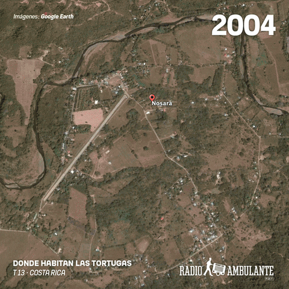
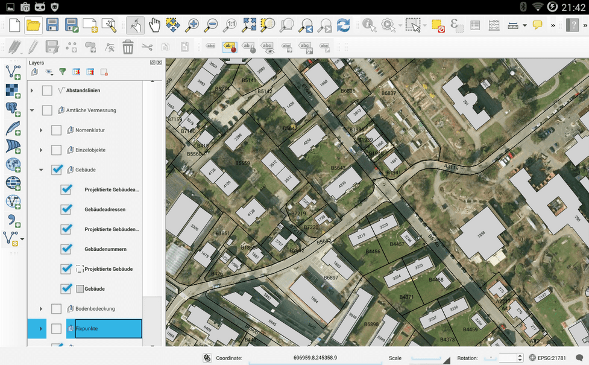
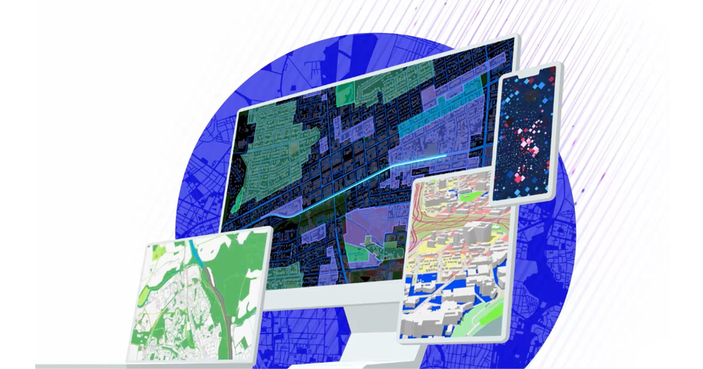

<!-- ========================= -->
<!--        PROFILE BANNER     -->
<!-- ========================= -->

  

<h1 align="center">Derrick Kipruto Totoitich</h1>
<h3 align="center">GIS • Remote Sensing • Earth Observation • Spatial Data Science</h3>

  <em>Delivering data-driven insights through geospatial intelligence</em>

  <a href="#home" class="active">Home</a> •
  <a href="#projects">Projects</a> •
  <a href="#skills">Skills</a> •
  <a href="#education">Education</a> •
  <a href="#contact">Contact</a>

---
## 🏠 Home

I am a **GIS, Remote Sensing, and Earth Observation specialist** with strong expertise in **spatial analysis, geospatial programming, cartography, and machine learning**.  
My work focuses on transforming **satellite imagery and spatial datasets** into actionable intelligence for environmental monitoring, land-use planning, and urban analysis.

**Professional focus:**
- Advanced GIS & Spatial Analysis  
- Earth Observation & Satellite Data Processing  
- Machine Learning for Geospatial Applications  
- Web Mapping & Geo-Visualization  
- Research-driven, scalable spatial solutions  

  

<a href="#top">⬆ Back to top</a>

---
## 🚀 Projects

<table width="100%" bgcolor="#0b1c2d" style="border-radius:14px; margin-top:25px;">
<tr>
<td>

Land Use / Land Cover classification, EO dashboards, spatial ML models,
and geospatial automation projects.

</td>
</tr>
</table>

🚧 *Selected professional and research projects will be highlighted here.*
### 🛰️ Land Use / Land Cover Classification

  

- Machine Learning–based classification  
- Google Earth Engine + Python  
- Multi-temporal satellite imagery  

**Planned featured work includes:**
- 🌍 Land Use / Land Cover (LULC) Classification using Machine Learning  
- 🛰️ Google Earth Engine EO Applications  
- 🌱 Environmental & Climate Monitoring Dashboards  
- 🏙️ Urban Spatial Analysis & Suitability Modeling  
- 📊 Cartographic & Interactive Web Maps  

  <em>Each project will include data sources, methodology, results, and visual outputs.</em>

<a href="#top">⬆ Back to top</a>

---
## 🛠 Skills

### 🗺️ GIS & Remote Sensing

  
  
  
  
  

### 💻 Programming & Data Science

  
  
  

### 🌐 Web & Visualization

  
  
  

  

<a href="#top">⬆ Back to top</a>

### 🤖 Spatial Analysis & Modeling
- Spatial Statistics & Geoprocessing  
- Machine Learning (Classification, Prediction, Clustering)  
- Land Use / Land Cover Analysis  
- Change Detection & Time-Series EO Analysis  
- Spatial Decision Support Systems  

---

<a href="#top">⬆ Back to top</a>

## 🎓 Education

**Bachelor of Science (BSc) – Geospatial Information Science & Remote Sensing**  
Dedan Kimathi University of Technology, Nyeri, Kenya  
 

**Core Academic Areas**
- Remote Sensing & Earth Observation  
- Spatial Modeling & GIS Automation  
- Cartography & Visualization  
- Machine Learning for Spatial Data  

---

<a href="#top">⬆ Back to top</a>

## 📬 Contact

I’m interested in:
- GIS & Remote Sensing roles  
- Earth Observation research & consulting  
- Spatial data science collaborations  

  
  
  

---

  <em>“Spatial data tells a story — I translate it into insight.”</em>

<a href="#top">⬆ Back to top</a>

